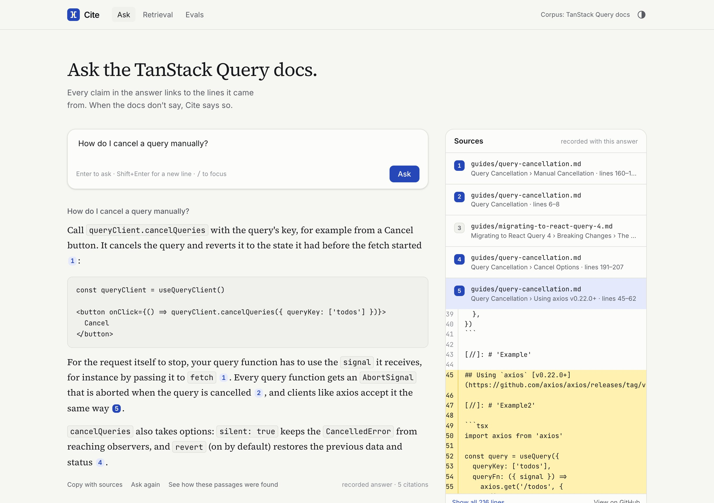
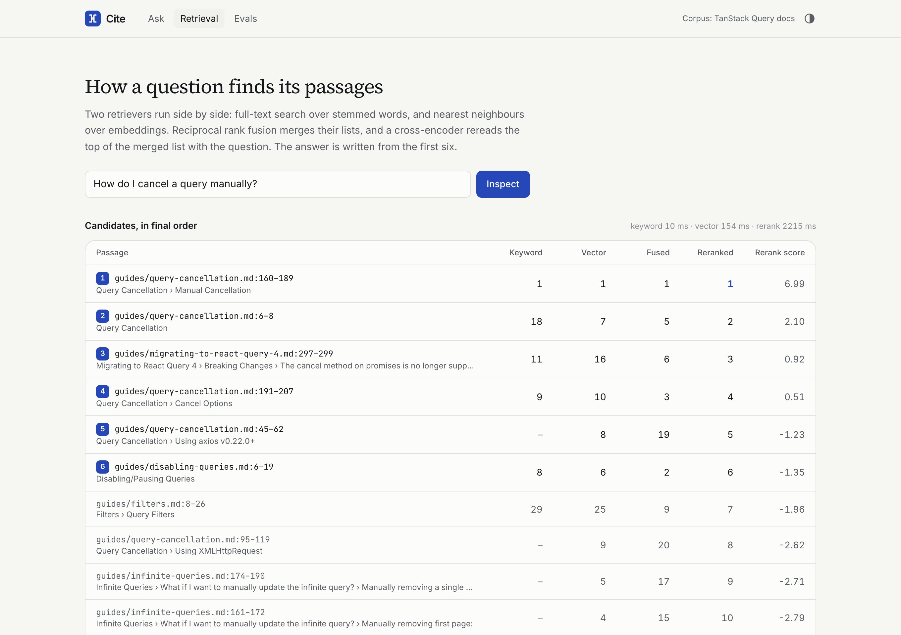
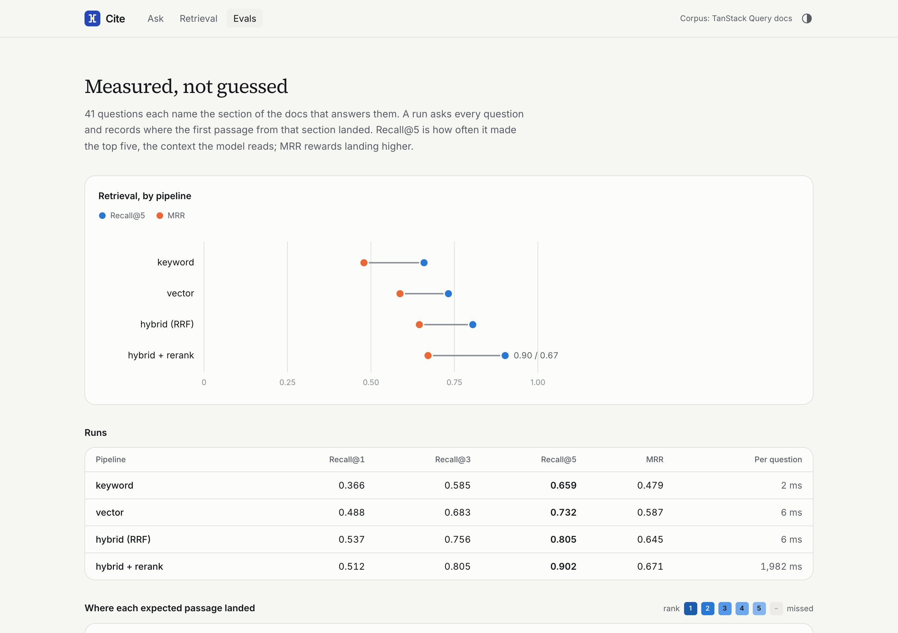

<p align="center">
  
</p>

<h1 align="center">Cite</h1>

<p align="center">
  Ask the TanStack Query docs a question. Every claim in the answer links to the lines it came from.<br>
  <sub>Next.js 16 · React 19 · Postgres + pgvector · local embeddings · Claude · Vitest</sub>
</p>

<br>

Most "chat with your docs" demos call a model and print what comes back. I
wanted the parts those skip: citations a reader can check in one click, an
answer that says "the docs don't cover this" instead of improvising, and
retrieval quality that is measured, so a change to the pipeline is a number
going up or down rather than a feeling.

The corpus is TanStack Query's React documentation (87 files, 894 passages),
copied at a pinned release with its MIT license. It is a set of docs most
frontend developers have read, which makes it easy to judge whether an
answer is right.



## Running it

Node 24 and Postgres with pgvector. Docker is the short way:

```bash
nvm use
npm install
docker compose up -d                # Postgres 17 with pgvector on :5432
cp .env.example .env                # DATABASE_URL is already right for compose
npm run db:migrate
npm run ingest                      # chunks and embeds the corpus, about 45 s the first time
npm run dev
```

The first ingest downloads the embedding model (bge-small, 33 MB) and the
first reranked question downloads the reranker (bge-reranker-base, 288 MB),
both into `~/.cache/cite-models`. Everything after that runs offline.

**Without an API key**, which is the default, the eight demo questions on the
home page replay answers I wrote by hand against the exact passages the
search returns for them, and any other question shows the passages Cite
would send to the model, with a note saying why there is no answer. Search,
the retrieval inspector and the evals all work fully.

**With a key**, put `ANTHROPIC_API_KEY` in `.env` and restart. Every
question, the demo ones included, then gets a live streamed answer from
Claude Opus 5.5.

| Command                                                |                                                                   |
| ------------------------------------------------------ | ----------------------------------------------------------------- |
| `npm test`                                             | 83 tests, no database or key needed                               |
| `npm run eval:retrieval -- --mode rerank`              | one retrieval run over the question set, written to `evals/runs/` |
| `npm run eval:answers`                                 | answer quality over the same questions; needs a key               |
| `npm run fixtures`                                     | re-records the demo answers against the current index             |
| `npm run typecheck` / `npm run lint` / `npm run build` | the usual                                                         |

## How retrieval works

1. **Chunking.** Markdown is split by heading, so a passage never straddles two
   sections, and long sections are cut into overlapping windows at blank
   lines without splitting a code block. Every passage keeps its file, its
   line range and the path of headings above it. That line range is what makes
   a citation clickable.
2. **Two retrievers.** Postgres full-text search over stemmed words, with
   headings weighted above body text, and the terms ORed together because a
   question is mostly words that are not in the answer. Next to it,
   nearest-neighbour search over 384-dimension embeddings with an HNSW index.
3. **Fusion.** Reciprocal rank fusion merges the two lists: each passage scores
   1/(60 + rank) in each list and the scores add up. It needs no score
   normalisation, which matters because a full-text rank and a cosine
   distance are not on the same scale.
4. **Reranking.** A cross-encoder (bge-reranker-base) reads the question and
   each of the top twenty passages together and reorders them. The model gets
   the first six.

The Retrieval page shows all four stages for any question, with each
passage's rank in each list, which is the part I would open first in an
interview.



## How citations work

The model gets the six passages numbered inside `<passage>` tags and is told
to put a number after each claim, or to answer with one fixed sentence when
the passages don't cover the question. Passage text is escaped so it cannot
close its own tag, the question is escaped the same way, and the system
prompt says the passages are reference material, not instructions.

As the answer streams, a parser splits it into text and citations. A marker
can arrive cut in half (`[1` in one chunk, `2]` in the next), so the parser
holds back only a tail that could still become a marker and releases
everything else at once. A number that points at no passage is dropped and
counted; the UI never offers a link to a source that was not sent. The parser
also tracks code fences and inline code across chunks, and remembers the last
character it released, so `data.pages[1]` and `[1, 2]` inside a snippet stay
code however the stream happens to split them.

Citations then reach the Markdown renderer as private-use characters, not as
Markdown links, and a small rehype step turns them into placeholders that the
view renders as buttons. Those characters are stripped from everything the
model writes, so a model-written `[docs](#cite-9)` is an ordinary link and
`all![1]` cannot become an image.

In the browser each citation is a button. Opening one shows the passage in its
file, with the cited lines highlighted, a few lines of context, and a link to
the same lines on GitHub at the pinned commit.

## Evals

41 questions in `evals/questions.yaml` name the section of the docs that
answers them, and 8 more ask about things the docs don't cover (SWR, Vue,
Django, CSS). A retrieval hit is a passage from the right file that overlaps
the right lines. These are the committed runs:

| Pipeline        | Recall@1 | Recall@3 | Recall@5  | MRR   | Time per question |
| --------------- | -------- | -------- | --------- | ----- | ----------------- |
| Keyword         | 0.366    | 0.585    | 0.659     | 0.479 | 2 ms              |
| Vector          | 0.488    | 0.683    | 0.732     | 0.587 | 6 ms              |
| Hybrid (RRF)    | 0.537    | 0.756    | 0.805     | 0.645 | 6 ms              |
| Hybrid + rerank | 0.512    | 0.805    | **0.902** | 0.671 | 1,982 ms          |

Fusion beats either retriever alone on every measure. Reranking lifts recall
at five, the context the model actually reads, from 0.805 to 0.902, at the
cost of about two seconds of CPU per question on a laptop. Recall at one
drops slightly with it, so for a "top result only" product I would not turn
it on. Four questions still miss in every run; they ask about defaults that
live in a long bulleted list, which chunks badly.

`npm run eval:answers` goes through the whole pipeline: it checks that every
citation resolves, that the cited passages include the expected one, that the
out-of-scope questions get the refusal, and has a grader judge whether every
claim is supported by its citations. It needs a key, and I have not
committed a run of it yet.



## Things worth opening

**`src/lib/citations.ts`.** The streaming citation parser: about seventy lines
and the tests that pin its edge cases.

**`scripts/record-fixtures.ts`.** The no-key demo answers are written citing
`{{file:line}}`, not a position. The recorder retrieves, maps each reference
onto wherever that passage landed, and refuses to write anything if a cited
passage was not retrieved. I added this after a reranker change silently
shifted two passages and one answer started pointing at the wrong source.

**`src/lib/generate.ts`.** The answer call, typed against a narrow slice of the
SDK so the tests can drive it with a fake client that emits the same stream
events. API failures become one error event instead of a broken stream, and a
safety decline is reported separately from "not in the docs".

**`src/components/answer-view.tsx`.** The Markdown renderer's components are
defined once, outside the component. When they were rebuilt on every render,
a hover update between mousedown and click remounted the citation button and
swallowed the click.

**`src/app/api/ask/route.ts`.** Newline-delimited JSON, a body limit, a
per-client rate limit, and a semaphore around the CPU-bound retrieval that
the Retrieval page shares.

## Tests

```bash
npm test
```

83 tests, none of which need a database or a key. They cover chunking (line
ranges, code fences, heading-only sections), fusion, the citation parser
(including splits after a word, markers inside code, and hostile Markdown),
prompt escaping, the generator against a fake stream, the fixture recorder,
the eval metrics against the committed question set, the ask route's
validation and limits, and the React components: citation buttons, link
sanitising, highlighted source lines, Stop, and a newer question superseding
one that is still streaming.

## Layout

```
corpus/              TanStack Query docs at a pinned commit, with SOURCE.md
db/schema.sql        chunks, tsvector, pgvector, indexes
evals/               questions.yaml and the committed runs
fixtures/            hand-written demo answers
scripts/             migrate, ingest, eval:retrieval, eval:answers, fixtures
src/lib/
  chunk.ts           Markdown to passages with line ranges
  retrieve.ts        keyword, vector, hybrid, rerank
  rrf.ts             reciprocal rank fusion
  prompt.ts          passages, escaping, the refusal sentence
  citations.ts       streaming citation parser
  generate.ts        the Claude call and its events
  answer.ts          retrieval, fixture or model, as one stream
src/app/             Ask, Retrieval and Evals pages; /api/ask, /api/source
```

## What's missing

- No answer-quality run is committed; the numbers above are retrieval only.
- One corpus. The pipeline is generic, but the eval questions and the GitHub
  links are written for this one.
- The rate limit and the semaphore are in-process. Behind more than one
  server they would need a shared store. `X-Forwarded-For` is only read when
  `TRUST_PROXY` says how many proxies append to it; without that setting
  every request shares one budget, because Next.js route handlers do not
  expose the socket address and the header alone is whatever the client sent.
- Reranking runs on CPU; on a small server it is the slowest part of every
  answer. A hosted reranker or a GPU would fix that.
- No conversation. Each question stands alone.

The code is MIT licensed. The corpus keeps its own MIT license, in
`corpus/LICENSE`.
